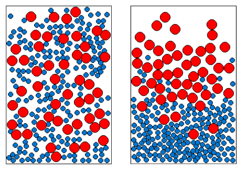
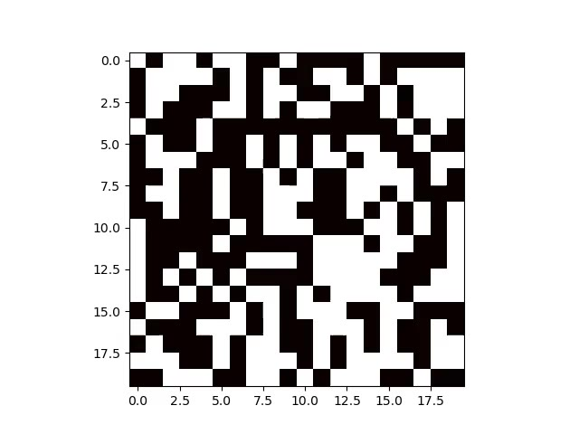
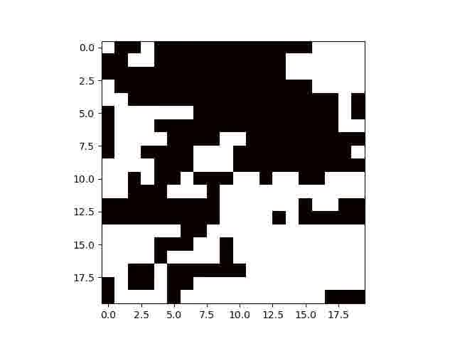

# Semester Project Simulations

### Brazil Nut Effect / Granular Convection

Granular Convection is an interesting phenomenon, wherein a collection of objects of different sizes in a box --- subject to gravity --- show vertical stratification on vigorous shaking. This was one of the earliest simulations run during the course of the project. The following image shows snapshots of the simulation at time t=0 and t~30s.

### Monte Carlo Simulation for Phase Separation

A very smple phase-separating system can be constructed as follows--- consider a mixture of particles A and B where A-A and B-B interaction energy is less than A-B interaction energy. Intuitively, the system, left to itself, would attempt to minimize Energy and therefore have like particles closer to each other. The same can be demonstrated using a simple monte carlo simulation, where a move is to swap two random particles, and the total interaction energy is minimized.

Note that this is not a very (even physically) realistic simulation. For one, we assume (by randomly swapping 'particles') that the system is ergodic (i.e. it can attain any confirmation, given infinite time). This is certainly not true for liquid-liquid phase separation. But this simulation provides a neat insight into LLPS.
